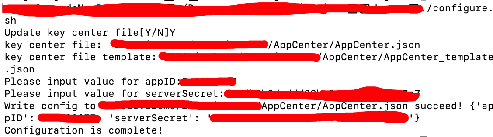
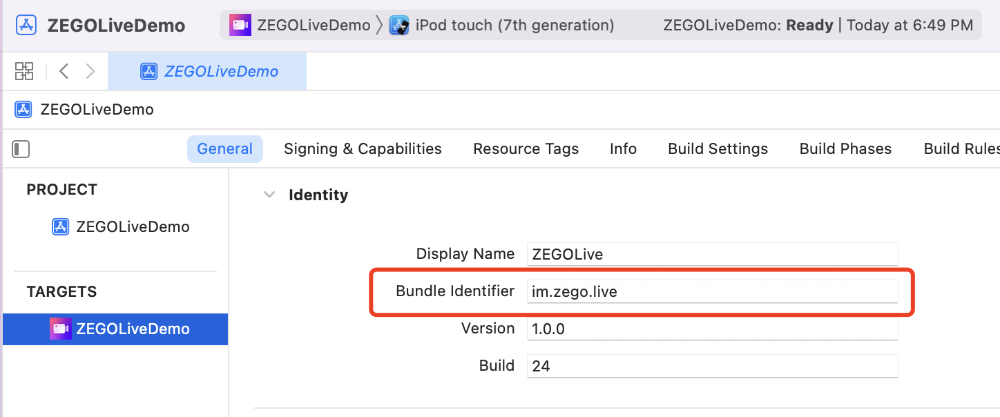
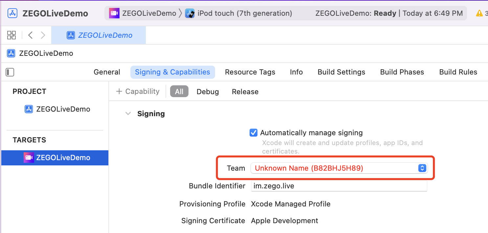
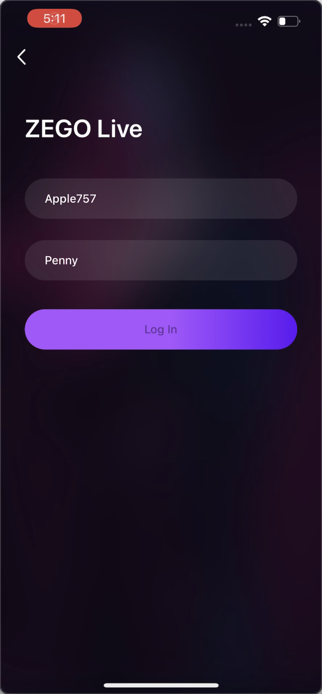

# ZEGOCLOUD Live

ZEGO Live is a one-stop product that you can use to build interactive live streaming experiences. You can create single-host, multi-host live streaming sessions with audio effects, face beautification, and more features provided by ZEGOCLOUD.

With ZEGO Live, users can create a live room to host, watch live video streaming events, invite participants in the live room to co-host, and more. Participants can send text messages to interact with the host and co-hosts in real time.

ZEGO Live can cover typical scenarios include live video streaming, live online classes, live-stream shopping/e-commerce, or live game streaming.

## Getting started

Before getting started with the ZEGO Live application, **contact us to activate the ZEGO Live (RTC + IM + Effects) service, get the ZegoEffects SDK, and the resources and models that are required**, and then do the following:

### Prerequisites

* [Xcode 12 or later](https://developer.apple.com/xcode/download)
* [CocoaPods](https://guides.cocoapods.org/using/getting-started.html#installation)
* An iOS device or Simulator that is running on iOS 13.0 or later and supports audio and video. We recommend you use a real device.
* Contact us to activate the ZEGO Live service, get the ZegoEffects SDK, and the resources and models that are required.
* Create a project in [ZEGO Admin Console](https://console.zegocloud.com/). For details, see [ZEGO Admin Console - Project management](https://docs.zegocloud.com/article/1271).

###  Install Pods

1. Clone the Live Room Github repository. 
2. Open Terminal, navigate to the `ZEGOLiveDemo` folder where the `Podfile` is located, and run the `pod repo update` command.
3. Run the `pod install` command to install all dependencies that are needed.

### Modify the project configurations

1. For macOs, open Terminal, navigate to the `live_audio_room_ios` folder where the `configure.sh` is located. 
2. Run the configuration script with the `./configure.sh` command. And fill in the AppID and ServerSecret, which can be obtained in the [ZEGO Admin Console](https://console.zegocloud.com/).  
   

3. Open the `ZEGOLiveDemo.xcworkspace` in Xcode.

4. In the **General** tab of the `ZEGOLiveDemo` project, change the `Bundle Identifier` configuration.

   

5. Click the **Signing & Capabilities** tab and select your own developer account in the **Team**.  

   

6. Create a `live_ios/ZEGOLiveDemo/Lib` folder and `live_ios/ZEGOLiveDemo/EffectResources` folder if you have not done so.
7. Copy the `ZegoEffects.xcframework` to the `live_ios/ZEGOLiveDemo/Lib` folder.
8. Add the resources and models that the ZegoEffectsSDK required into the `live_ios/ZEGOLiveDemo/EffectResources` folder.

### Run the sample code

1. Connect the iOS device to your computer.

2. Open Xcode, click the **Any iOS Device** in the upper left corner, select the iOS device you are using.

3. Click the **Build** button in the upper left corner to run the sample code and experience the Live Audio Room service.

   

## Project structure

The project consists of two modules: **ZEGOLive** and **ZEGOLiveDemo**.

#### ZEGOLive

The ZEGOLive improves reusability and further encapsulates the RTC, IM, and Effects for you to integrate easier. The following shows the structure:

Directory path: 

```
{your_project_root_path}/live_ios/ZEGOLiveDemo/ZEGOLive
```

```tex
.
├── Core
│   ├── Define.swift                     --- Common definitions and error codes of ZEGOLive.
│   ├── Extensions                       --- Service related extensions 
│   ├── Manager
│   │   ├── RoomManager.swift            --- Room related instances that used to initialize the SDK, and provide the capabilities for service implementation.
│   │   └── ZIMManager.swift             --- The ZIM instances for the SDK use.
│   ├── Model                            --- Models, such as UserInfo, RoomInfo, and more.
│   └── Service										
│       ├── DeviceService.swift          --- Streaming and device related service, such as stream publishing, playing and configure audio and video settings.
│       ├── FaceBeautifyService.swift    --- Face beautify service
│       ├── MessageService.swift         --- Real-time messaging service
│       ├── RoomListService.swift        --- Business server related sercice, such as room list updates, in-room heartbeat and more.
│       ├── RoomService.swift            --- Room related service, such as join/leave a room, update room information, and more.
│       ├── SoundEffectService.swift     --- Sound effects service
│       └── UserService.swift            --- User related service, such as take/leave a seat, turn on/off the microphone/camera, make co-host, and more.
├── Network
├── Request
└── Tool
```


#### ZEGOLive Demo

The Demo module implements the business and UI interaction logic, including login, room list, live streaming, face beautify, sound effects feature, and more. The following shows the structure:

Directory path: 

```
{your_project_root_path}/live_ios/ZEGOLiveDemo/ZEGOLiveDemo
```

```tex
.
├── AppCenter           --- AppID, AppSign,ServerSecret and more
├── Assets.xcassets     --- Images, colors, and more resources
├── CorePages           --- UI and business logic of core features 
│   ├── Home            --- Homepage
│   ├── IM              --- Instant messaging (IM)
│   ├── Login           --- Login
│   ├── MusicEffects    --- Sound effects
│   ├── Room            --- Live room related
│   ├── RoomList        --- Room list 
│   ├── Settings        --- The Settings page
├── Extensions          --- Class extensions
├── Helper              --- Utilities
├── Resource            --- Resource files, including language file and more
```


## More documentation

You can find more documentation on our official website: [ZEGO Live (RTC + IM + Effects)](https://docs.zegocloud.com/article/13811).

